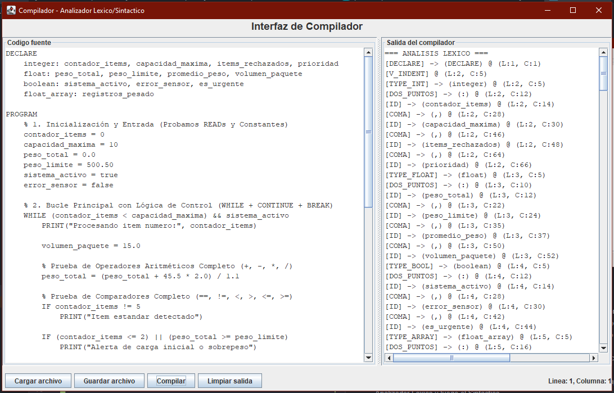

# Compilador UNNOBA 2026 - Grupo 2

Este proyecto consiste en un compilador educativo desarrollado en Java, utilizando **JFlex** para el análisis léxico y **CUP** para el análisis sintáctico. El lenguaje implementa **identación significativa** (estilo Python) para la delimitación de bloques y un sistema de trazabilidad basado en reglas formales.

---
## Tema Especial: Suma Acumulativa 

El compilador incluye una implementación exclusiva requerida por la cátedra para el manejo avanzado de expresiones y listas:
* **Sintaxis:** `suma_cumulativa(multiplicador, [lista_de_valores])`
* **Descripción:** Permite realizar operaciones sobre arreglos de valores flotantes, escalados por un factor. Demuestra la capacidad del parser para manejar anidamiento de corchetes, comas y llamadas a funciones complejas dentro de asignaciones.

---

## Características Técnicas

* **Análisis Léxico:** Gestión de estados para el reconocimiento de identificadores, constantes, operadores y palabras reservadas.
* **Bloques por Identación:** Uso de una pila interna en el Lexer para generar tokens virtuales `V_INDENT` y `V_DEDENT` basados en el nivel de espacios/tabs.
* **Análisis Sintáctico:** Gramática LALR procesada por CUP, con soporte para estructuras flexibles (opcionalidad de paréntesis en `IF` y `WHILE`).
* **Logs de Reducción:** El parser emite un rastro en tiempo real por consola con el formato `no_terminal ::= producción`, permitiendo auditar el árbol de derivación.
* **Interfaz Gráfica (GUI):** Entorno visual para edición de código, visualización de tokens y reconstrucción sintáctica.

---

## Estructura del Proyecto

```text
src/
├── Lexer/
│     ├── lexico.flex      # Definición léxica y lógica de la pila de identación.
│     ├── Lexer.java       # Analizador generado por JFlex.
│     └── Generador.java   # Clase para regenerar el Lexer y el Parser.
├── Parser/
│     ├── parser.cup       # Gramática formal y acciones de reducción.
│     ├── Parser.java      # Analizador sintáctico generado por CUP.
│     └── CupScannerAdapter.java # Conector entre el flujo de tokens y CUP.
├── TablaSimbolo/
│     └── TablaSimbolo.java # Gestión de variables, tipos y constantes.
├── service/
│     └── CompilerService.java # Coordinador de las fases de compilación.
├── gui/
│     └── Main_gui.java    # Interfaz gráfica de usuario.
└── pruebas.txt            # Archivo de prueba principal.

```

## Requisitos y Dependencias

- Java 21 (LTS) o superior.
- Maven 3.6+ para la gestión de dependencias (JFlex y java-cup-runtime).
- IntelliJ IDEA (Recomendado para visualizar los logs de reducción en la consola).

---

## Instalación y Desarrollo

1. Clonar el repositorio:
   git clone https://github.com/Francisco9403/analizador_lexico_GRUPO_2.git

2. Generar los analizadores (Importante):
   Si realizas cambios en lexico.flex o parser.cup, debés regenerar las clases Java ejecutando:
   mvn exec:java -Dexec.mainClass="Lexer.Generador"

3. Compilar el proyecto:
   mvn clean install

4. Ejecutar la Interfaz Gráfica:
   Iniciá la aplicación desde la clase Main_gui para acceder al entorno visual.

---

## Uso de la Interfaz Gráfica (GUI)

La aplicación cuenta con un entorno visual diseñado para facilitar la escritura, prueba y depuración de código en nuestro lenguaje.


### Componentes de la Interfaz:

1. **Editor de Código (Panel Izquierdo):** Área principal de trabajo con numeración de líneas. Aquí podés escribir tu código manualmente o cargar un archivo fuente existente (como `pruebas.txt`).
2. **Consola de Resultados (Panel Derecho):** Muestra la salida del proceso de compilación.
   - **Éxito:** Muestra la reconstrucción sintáctica limpia del programa.
   - **Error:** Muestra mensajes de error léxicos o sintácticos precisos, indicando la línea y columna exacta del fallo.
3. **Botón de Compilación :** Es el gatillo del sistema. Ejecuta la cadena completa del compilador: primero el Analizador Léxico y luego el Sintáctico.
4. **Botón de Guardar:** Guarda los cambios realizados en el editor de código, ideal para ir ajustando los casos de prueba sin salir de la aplicación.
5. **Botón de Limpiar:** Borra el contenido de la consola de resultados y limpia el entorno para realizar una nueva ejecución desde cero, sin mezclar salidas anteriores.
6. **Abrir/Cargar Archivo:** Permite explorar el sistema y cargar un archivo de código fuente (ej. `pruebas.txt`) directamente en el editor izquierdo.

---
## Archivos Generados
**ts.txt**: Al finalizar la compilación con éxito, el sistema genera o actualiza automáticamente este archivo. Contiene la Tabla de Símbolos detallando los nombres, tipos, longitudes y valores de cada identificador y constante detectada durante el análisis léxico.


---

## Auditoría (Logs del Parser)

Mientras interactuás con la GUI, la **consola de tu IDE** (en segundo plano) mostrará el proceso de reducción en tiempo real para verificar la validez de la gramática formal:
- `[PARSER LOG] sentencia_if ::= IF expresionOr bloque elif_part else_part`
- `[PARSER LOG] asignacion ::= ID ASIG expresionOr`
- `[PARSER LOG] program ::= seccion_declaracion seccion_sentencias`


---


## Integrantes 
- Luis Francisco Martínez

- Augusto Greco

- Renzo Ariel Pellizzari
